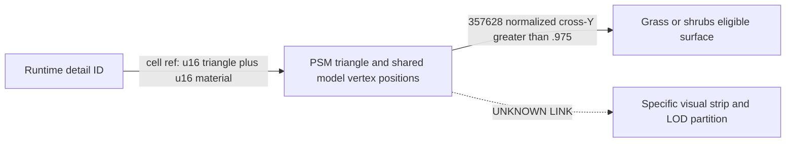

# PS2-GRASS1 findings

**PS2-GRASS1 STATUS: PARTIAL.** The authored material → spatial surface →
runtime generated point → texture handle → CPU/VIF packet chain is recovered.
Matching embedded VU1 point-to-sprite and state-to-GIF programs are decoded.
Their upload/residency and final frame flush are not connected to CPU execution.
Independent PS2 runtime validation is **NOT_PERFORMED**.

The mechanism is an incremental, camera-region terrain decorator. It reads
the landscape's spatial/collision triangle table, using positions shared with
the visual model. It does not scan printable render-material names to invent
grass populations, and it does not sample randomly chosen barycentric points.
Its world XZ scanline lattice uses pitch `float32(1.33)`, deterministic
coordinate-hash jitter and an original-triangle height plane. Only near-flat,
upward grass/shrubs surfaces reach the two point pools.

The internal detail value is a runtime string-interner ID. It is **not** a
fixed enum derived from string-anchor order. Shrubs uses pool 0 and
`particles/bush1`; grass uses pool 1 and `particles/grass1`. Stones is
recognized/stored but excluded from this generator. Turkey_S1's authored
singular `$detail(shrub)` has real triangle bindings and also fails the
grass/shrubs ID comparisons. None and missing-detail defaults are excluded.

Four causal chains, with the actual proof boundary:

Chain A: `CONFIRMED_BY_BOTH`; the original material bytes and original ELF
parser input/output agree. [Material contract](material-directive-contract.md).

Chain B: the solid links are `CONFIRMED_BY_BOTH`. Actual spatial surfaces,
including a positive and a negative control, are established. Their complete
visual strip/LOD equivalence is not. [Binding](material-to-geometry.md) and
[eligibility](surface-eligibility.md).

Chain C: the CPU producers and clip invocation are `CONFIRMED_BY_EXE`; source
inputs are `CONFIRMED_BY_BOTH`. The clip algorithm is not independently
reimplemented. The diagnostic exercises a supplied full triangle with
**synthetic activation**, not an original camera trajectory. Embedded pc449
defines projected corners, STQ, FTOI4 and size cap56; runtime residency remains
STATIC_INFERENCE. [Primitive contract](primitive-geometry.md).

```mermaid
flowchart LR
  A[Grass or shrub pool] -->|record +40 name ID / 2fd7d0 / 311c50| B[GXI resource handle and texture state]
  B -->|31c8f8 / 31e478| C[State template transfer and MSCAL 37c]
  D[64-byte point records] -->|31da60 REF and V4_32 UNPACK| E[MSCAL 449]
  C --> F[Completed detail packet]
  E --> F
  F -->|359610 / 317120 / 31e010| G[Frame DMA CALL chain]
  G -. UNKNOWN LINK: program upload and last flush .-> H[Embedded pc37c/449 and output ring pc3c9]
  H -->|embedded pc3d7 instruction| I[XGKICK to GIF]
  I -. UNKNOWN: no controlled frame capture .-> J[Visible GS drawing]
```

Chain D: the CPU packet/binding/queue links are `CONFIRMED_BY_EXE`. The GS
register identities and encoded state are independently checked, but a live
GIF packet/visible instance was not captured. Conditional embedded geometry,
state-copy and XGKICK contracts extend the analysis beyond CPU packets without
inventing the missing upload/last-flush link. [Draw contract](draw-pipeline.md).

The bounded structural check passed **36/36** landscapes, covering **671,413**
uniquely material-bound source triangles. Selected float32 eligibility counts
are surface counts, never tuft counts. All original geometry, point coordinates,
raw queries and logs stay ignored; committed metadata contains hashes, offsets,
counts and short material facts. See [case evidence](case-evidence.json),
[function inventory](elf-functions.json) and [closeout](final-report.md).
