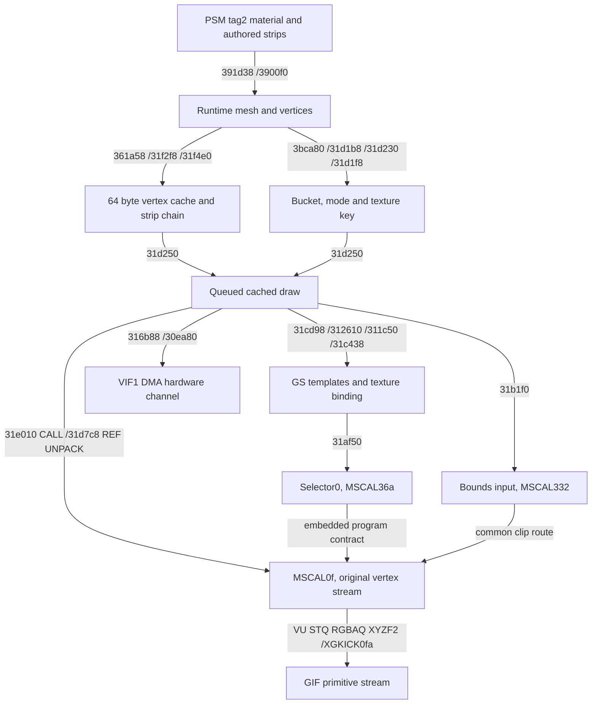

# Foliage CPU/VIF/VU/GIF/GS pipeline

The mesh callback at `3bca80` skips empty strips, prepares/reuses the general cache through `361a58`, and delegates wrapper construction to `31f2f8`/`31f4e0`. It supplies mesh+28 mode, +2c bucket and +dc/+e4 texture handles to the common renderer.

All diagram arrows are canonical executable/data-flow evidence. It depicts the static producer/embedded-program contract; it does not assert a captured frame or live micro-RAM residency. Hardware upload and vertex processing are related parts of one chain, not independent direct GS draws from the CPU.

## Packet producers

`31c438` commits dirty shared state through the global AD, primary and secondary helpers (`31e8d8`, `31e478`, `31e6a8`) and the selector upload `31af50`. Selector0 is written to VU input317.w with MSCAL36a. Both tree modes use this coordinate path; only the controlled material-state/bucket/texture-option/mip fields differ.

`31b1f0` uploads the common mesh-bound input with MSCAL332. Common object/view/projection producers `317470/317770` use the established matrix inputs and VU entries2cf/30e. No foliage billboard matrix producer is installed by these callbacks.

`31d7c8` references the cached stream with UNPACK of four qwords per vertex and MSCAL0xf. `31e010` adds a DMA CALL for a cached chain. The batching/cache infrastructure is shared with ordinary object geometry. Source strips are not independently counted as live draw calls; cache batching and clipping may change packet subdivisions.

`316b88` flushes the graphics ring/chain through `30ea80`. Original hardware stores set VIF1 QWC at10009020 to0, TADR at10009030 to the chain, and CHCR at10009000 to0x145. This is a real submission producer, not a guessed function near a graphics string.

## Embedded program and upload

Original initialization function `311370` calls `317208`; the upload producer DMA-CALLs the embedded chain at442170. Five MPG commands at44217c,442984,44318c,443994,44419c upload micro-PC0/100/200/300/400, counts256/256/256/256/201. Original ranges and SHA-256 values are in `instruction-evidence.json`.

Selector0 at micro0xf reads position q3, color q1, UV q2 and control q0.w. It does not use normal q0.xyz to form a camera-facing basis. The ordinary matrix/projection path produces Q=1/W, perspective STQ, FTOI0 RGBA and FTOI4 XYZF2. The regular path XGKICK is at micro0xfa, canonical ELF442950; the shared flush path includes micro3d7. Common clipping is accounted for, so the ordinary route is not claimed to cover every clipped output packet instruction-for-instruction.

The microprogram byte decoder is reused from the previous bounded analysis, with original pairs retained. Ghidra's temporary LQ/SQ low64 surrogates are marked; original words are always the byte oracle. Critical R5900 MADD/MULT semantics are annotated separately.

| Evidence stage | Status |
|---|---|
| Embedded program bytes/hashes | EMBEDDED_PROGRAM_CONFIRMED |
| Initialization-to-upload producer | UPLOAD_PRODUCER_CONFIRMED |
| Cache, selector, REF/UNPACK/MSCAL and GS template inputs | CPU_PACKET_CONTRACT_CONFIRMED |
| Selector0 transform/color/UV/output compatibility | CONFIRMED_BY_EXE, bounded program route |
| Actual live micro-RAM contents | LIVE_RESIDENCY_UNKNOWN |
| Selected visible foliage draw | LIVE_FRAME_NOT_CAPTURED |

Static closure is supported by original upload/call producers, not merely by a microprogram that happens to accept similar packets. Independent live validation remains unperformed.
