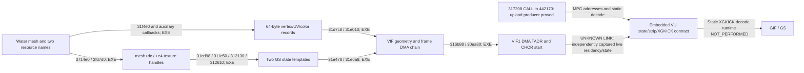

# PS2-WATER1 findings

**PS2-WATER1 STATUS: COMPLETE at the bounded static RE level.** Runtime
validation is **NOT_PERFORMED**. The two primary questions now have an
asset/executable-backed answer; actual frame visibility, inherited GS state
and live VU residency remain separate capture requirements.

Turkey3 has authored visual `puddle` meshes in the landscape scene tree:
17 mesh records, 51 strips, 745 non-suppressed nondegenerate source triangles,
537 distinct XYZ positions and 11 diagnostic edge-connected components.
Their surfaces have no triangle/vertex counterpart in the validated PC
landscape draw corpus. A separate all-PC-triangle height test also finds no
coplanar centroid at a 0.001-world-unit tolerance. This is
**EXTRA_PS2_VISUAL_GEOMETRY_IN_SCANNED_COMPILED_LANDSCAPE**, not just an extra
material string. It does not prove that every source triangle is visible.

The controls prevent generalizing that finding: France1's 3,586 water-related
triangles and Italy_S1's 1,329 triangles all match PC geometry in the same
coordinate system. Italy changes shader classification from PC `water` to
PS2 `puddle` on shared surfaces.

`391690 -> 3a6c58` selects real mesh modes: `puddle=9`, `water=10`,
`waterfall=waterall=19`. The latter spellings have separate registrations and
handlers with the same material result. Water/puddle preserve the course's
first texture and add `CommonTextures/watersurface2`. Puddle updates cached
UVs per frame; ordinary water's auxiliary frame callback is empty. The traced
callbacks write UV/color, not XYZ. There is no newly generated puddle plane
in this path.

The second puddle layer is particularly informative: TCC=0, alpha blending
`Cs*56/128+Cd`, depth writes masked. Ordinary water instead has TCC=1 and
`(Cs-Cd)*As/128+Cd`. Texture alpha, GS alpha test and blending are different
contracts. The traced mode setup disables alpha testing; ZTE remains inherited.

The four chains below use **CONFIRMED_BY_BOTH** for byte layout plus matching
ELF consumer, **CONFIRMED_BY_EXE** for CPU flow, and explicitly bounded static
VU decoding. No arrow asserts an independently observed runtime frame.

Read [Turkey3 delta](turkey3-delta.md), [material contract](water-material-contract.md),
[geometry](psm-water-geometry.md), [draw pipeline](draw-pipeline.md),
[validation](validation.md) and [final report](final-report.md). Compact
original-data facts are in `case-evidence.json`, `texture-evidence.json` and
`elf-functions.json`; full extracted content remains ignored.
