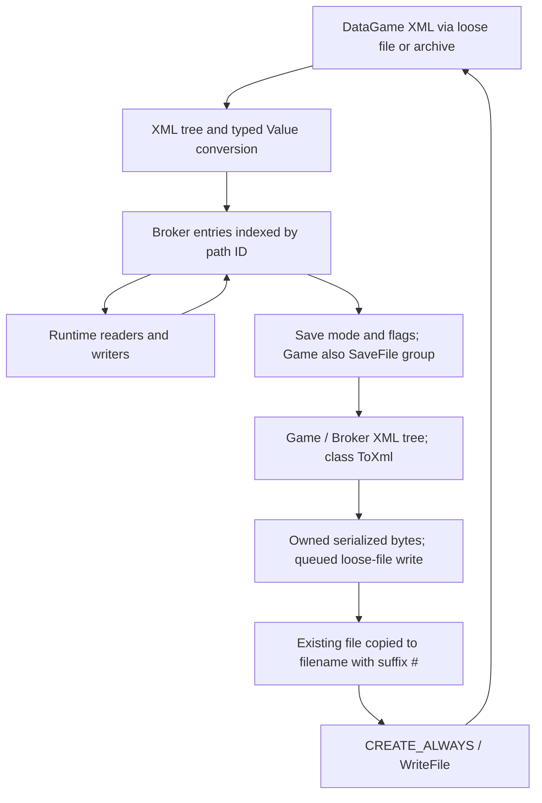

# R-BROKER1: persistence architecture

## Accepted model

SaveFile provenance/grouping, three save bits, and scope are independent entry
fields. Generic serialization selects eligible live entries, builds Game/Broker
XML in memory, then queues a **loose-file** write. Startup reload uses the same
typed XML conversion and assigns new loader metadata. This is architectural
persistence, not a dedicated opaque savegame-memory image.

### New facts with independent evidence

- Game mode requires Game bit **and** logical SaveFile match; Options and
  PlayerState select their own bits across files. Proven in `005FE460` assembly
  and tied to command/caller mode arguments.
- `__NO_SAVE`/`__NO_CHANGE` are explicitly excluded by the registry-driven
  whole-Game saver; neither string is a universal veto inside the generic
  Options/PlayerState filter.
- The native queued writer **does make a backup**: existing file → sibling
  filename with suffix `#`, through `CopyFileA(..., FALSE)`, then `CREATE_ALWAYS`
  and WriteFile. It overwrites the previous backup and is not atomic.
- Successful startup loads Game and its dependencies before options, then
  PlayerState. Root requests immediately pump the resource queue; dependency
  jobs join that queue and are drained before the next successful root request.
- Progress defaults and loaded PlayerState values meet at the same Broker paths.
  SavePlayerState annotations in corpus and the owner's runtime SaveFile reassignment
  corroborate the merge/override mechanism.
- Retail generic editor's top-level Commit/Cancel commands are no-op table
  entries (`006645C0`, table `00664718`). Broker value-dialog acceptance is a
  separate active live mutation path; menu names alone were misleading.

## Explicit historical corrections

R-DEV1 `game-scene-io.md` said no application backup was found. R-BROKER1 followed
the queued writer to `0064D030/0064D050/0064D530/0064D830`: a one-generation `#`
backup exists. The old result is retained with a correction note.

R-DEV1.2 called `004D54A0` a broker key-ID list insertion. It is a SaveFile
registry insertion, as shown by entry +18 enumeration and whole-Game saver use.
Earlier open-only risk classification remains valid.

## State and next gate

Static save/load architecture is sufficient to prepare a **normal Options and
PlayerState observation in a disposable copy**. It does not authorize using
developer SaveGame/SaveAs through the observational helper. SCENE/USER lifecycle,
the new frontend's Windows command/capture chain and actual round-trip behavior
remain open. Overall R-BROKER1 is PARTIAL; no runtime save test was performed.

See [save modes](save-modes.md), [writer](save-pipeline.md),
[load order](load-order.md), [human plan](runtime-validation-plan.md),
[unknowns](known-unknowns.md). Scope/revision facts are canonical in
[Broker core](../broker-core/findings.md).

No atomic replacement is implied by this diagram. Copy and write failures take
error callbacks; a partial new file is possible after truncation.
