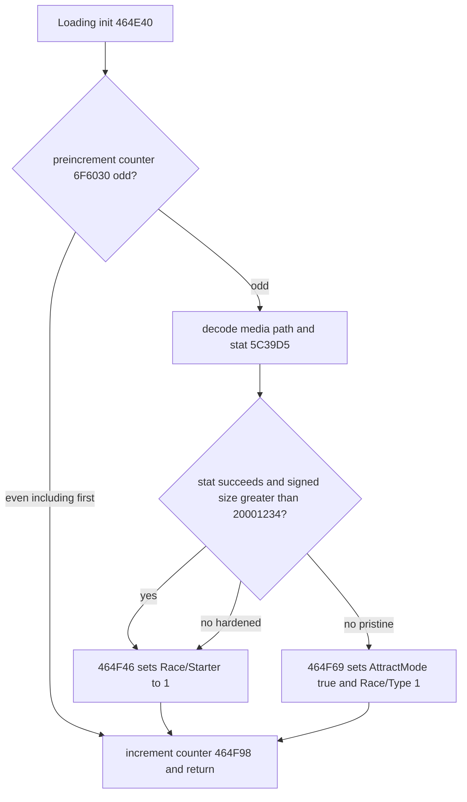

# Legacy Loading media failure — narrow redirect

Evidence: **CONFIRMED_BY_EXE**, exact pristine retail SHA256
`bf8aef32407eb6552c05045b8abef149f32983cedd9503b865069b444c5f96b4`.
Function `0x464E40..0x464FB6` is Loading AI initialization; name getter
`0x464D20` returns `gaFEScreenLoadingAI` at `0x6B51D0`, vtable reference
`0x69065C`. No participant/count or chooser logic is involved.

Counter read `0x464E8A`, TEST AL,1 at `0x464E8F`, even JZ `0x464E99`;
counter increment/store `0x464F98/0x464FA3`. Odd invocations decode twelve
bytes, XOR `0xAA` and exchange bits0/7, to `D:\SETUP.DLL`. The drive character
is then overwritten from `0x6FDF90`: initialization `0x5B0660` defaults to
lowercase `d`, optionally takes the first character of registry `CDDrive`.
The runtime path is therefore the configured drive, not invariably uppercase D.

`_stat` at `0x464F30` targets `0x5C39D5`; nonzero return JNZ `0x464F3A`
and signed `st_size <= 0x20001234` JLE `0x464F44` both target `0x464F69`.
The stock success key is `Race/Starter` at `0x6B51E4`, Int setter `0x4D8000`.
Failure key is `Race/AttractMode` at `0x6B1F84`, Bool setter `0x4D7AA0`, then
`0x4AC1C0(1)` sets Race/Type. Subsequent `0x449A50` recognizes Attract and
sets Type14; that later logic remains unchanged.

## Patch and unaffected idle owner

Only `0x464F69` / file `0x64F69`, five bytes:
`68 84 1F 6B 00 -> E9 D8 FF FF FF`, JMP `0x464F46`.
This reuses the entire stock success path on failure. Decoder, stat, threshold,
invocation counter, ordinary first loading, timers and all other code remain.

Legitimate idle owner is MainMenu AI `0x4652A0/0x4655E0`, name getter
`0x465180`. Init reads `Race/TimeToAttract` at `0x465339`; default `0x708`
ticks. Its separate media failure can shorten the idle timeout to2 ticks;
that is also preserved. Update tests the timer at `0x465694..0x465699`; when
negative it sets Attract true at `0x4656B7` and transitions via
`0x4656C1 -> 0x45D910(10)`. UI activity resets its timer. MainMenu, Type14
flow `0x449A50/0x449E90`, and stock chooser `0x4584F0` are byte-identical.
Idle Attract can still legitimately occur, including its original short timeout.

## Exact convenience-build comparison

Known widescreen/freeze hash
`bcf310a79133b03aa89ce51197a37516ee27c1b0e9da19788519e849e7a2f2f6`, size
3,121,214, was read only. The complete Loading function byte interval
`[0x464E40,0x464FB6)` is **identical to pristine**. Thus the hypothesis that
this exact build redirects failure inside this function is **DISPROVED**.
The previously reported absence of the symptom is not explained by these bytes;
other build differences/environment are **UNKNOWN**, outside this pass.
No convenience-build bytes were copied into the patch.

Native emulator:40 executions, counters0..3 crossed with missing/stat failure,
zero size, exact threshold, threshold+1 and signed-negative size for pristine
and hardened code. Native decode, branch flow, counter and RET/ESP/SEH execute;
stat/allocation/Broker setters are synthetic boundaries. All assertions pass.
These are historical static proofs. The subsequent human Restart loaded normal
race2 with Type2, AttractMode=False and NumPlayers1: **LEGACY LOADING->ATTRACT
FALSE TRIGGER HARDENING CONFIRMED_BY_RUNTIME**. Idle Attract preservation
remains static evidence only; no explicit human idle test was reported.
[Final closeout](runtime-closeout.md).
