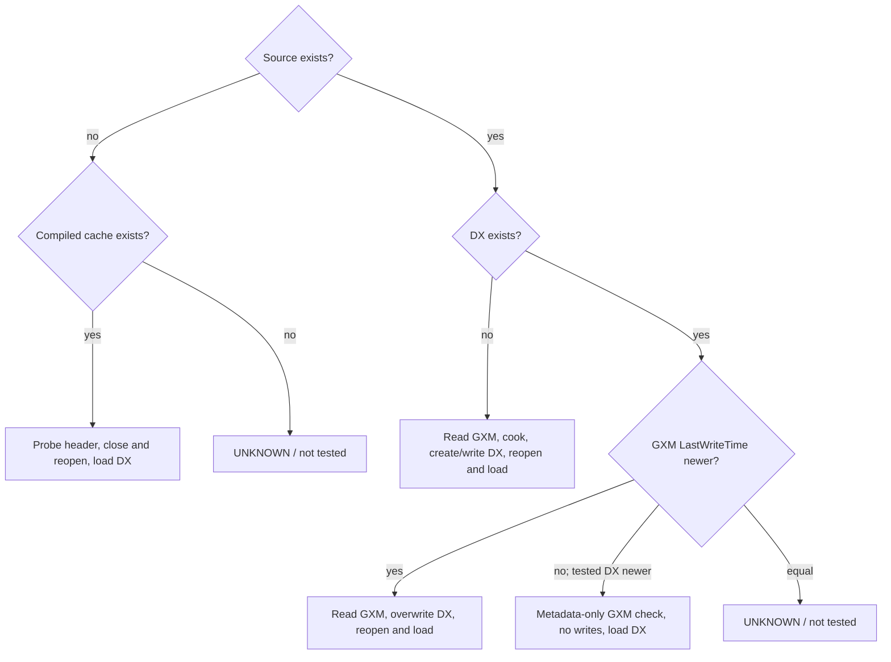

# 9.3.1 model cache state machine — controlled runtime evidence

Status: **CONFIRMED_BY_CONTROLLED_RUNTIME_TRACE** for the four tested states below. The CSV filenames were not treated as labels: event contents corrected two names. Raw CSV files and generated JSON remain ignored under `.research-output/r-demo2/procmon/`.

| Initial source/cache state | Observed event sequence | Classification |
|---|---|---|
| `complete.gxm` exists; `complete.dx` missing | GXM metadata → DX `NAME NOT FOUND` → 260,220 source bytes read → DX `OverwriteIf / Created` → 7,494 writes (134,349 bytes) → close/reopen → 7,494 matching reads | `CACHE_MISS_BUILD` |
| `complete.gxm` missing; `complete.dx` exists | GXM `NAME NOT FOUND` → DX metadata → separate 2-read header probe (0/4, 4/4) → close/reopen → full DX read to EOF; no writes | `SOURCE_MISSING_COMPILED_FALLBACK` |
| both exist; GXM LastWriteTime `08.10.2001 14:43:00`, DX `03.10.2001 10:06:44` | source body read → existing DX `OverwriteIf / Overwritten` in place → rewrite → close/reopen/load | `STALE_CACHE_REBUILD` |
| both exist; GXM LastWriteTime `08.10.2001 14:43:00`, DX `24.09.2026 21:34:13` | source metadata only, zero GXM reads → separate 2-read header probe → close/reopen/full DX load; zero DX writes | `FRESH_CACHE_HIT` |
| `Black-tga.gxi` exists; `.dxt` missing | GXI metadata (EOF 1,032) → DXT `NAME NOT FOUND` → two GXI reads (8 + 1,024) → DXT `Created` → 261 DWORD writes → close/reopen → 261 matching DWORD reads | `GXI_DXT_CACHE_MISS` |

The four model outcomes are **CONFIRMED_BY_CONTROLLED_RUNTIME_TRACE** for these tested paths and timestamps. The variable deliberately controlled was file LastWriteTime ordering; unrelated metadata behavior is not inferred. Both-missing and equal-time states remain **UNKNOWN**. The source-missing fallback proves a compiled DX can load without GXM; it does not prove all compiled resources are valid.

The CSV with `complete_hit` in its name is the source-missing fallback. The CSV with `SOURCE-MISSING COMPILED FALLBACK` in its name is actually the stale-cache rebuild. `dx-newer` is the fresh-hit control.

The miss and rebuild paths show a writer followed by a reader whose offset/length pairs match exactly: DX 7,494/7,494, continuous coverage `0..134349`; DXT 261/261, continuous coverage `0..1044`. This is **CONFIRMED_BY_RUNTIME_TRACE** of mirrored serialization/deserialization traversal, not proof that both use the same internal function.

The fresh-cache policy is sufficient for the current model-cache question. Broad ProcMon cache archaeology is frozen; only a narrowly justified executable question should reopen capture work.
